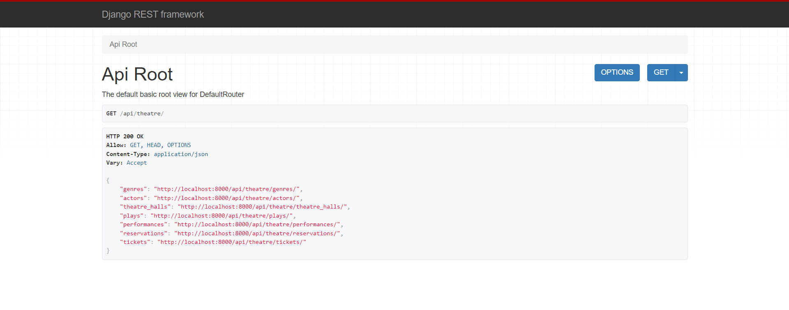

# Theatre Service API
An API for a theatre, the idea is to allow visitors of the Theatre to make Reservations online and choose needed seats, without going physically to the Theatre.

# Features
* JWT authenticated
* Admin panel /admin/
* Documentation is located at /api/doc/swagger-ui/
* Managing plays, actors, genres, theatre halls, reservations, tickets
* Filtering and validation of tickets data
* Email based authorization (username replacement)
* Email notification using Celery
* Managing tasks using Flower

# Installing using GitHub
Install PostgresSQL and create database
> git clone https://github.com/BohdanKuzik/theatre-service.git
> 
> cd theatre-service
> 
> python -m venv venv
> 
> source venv/bin/activate
> 
> pip install -r requirements.txt
> 
> Create and fill .evn file using .env.template
> 
> python manage.py migrate
> 
> python manage.py runserver

# Run with Docker
Docker should be installed
> docker-compose build
> 
> docker-compose up

### Getting access
* create user via /api/user/register
* get access token via /api/user/token/
* renew token, if needed via /api/user/token/refresh/

# DEMO
